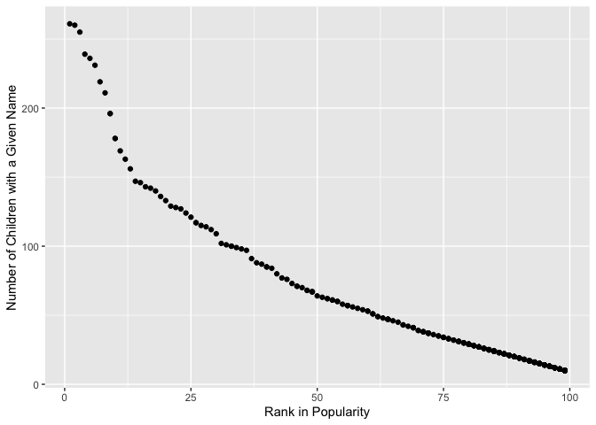

lg2982
================
Lizbeth Gomez
9/28/2019

\#\#Problem
    1

``` r
library(tidyverse)
```

    ## ── Attaching packages ──────────────────────────────────────────────────────────────────────────────────── tidyverse 1.2.1 ──

    ## ✔ ggplot2 3.2.1     ✔ purrr   0.3.2
    ## ✔ tibble  2.1.3     ✔ dplyr   0.8.3
    ## ✔ tidyr   1.0.0     ✔ stringr 1.4.0
    ## ✔ readr   1.3.1     ✔ forcats 0.4.0

    ## ── Conflicts ─────────────────────────────────────────────────────────────────────────────────────── tidyverse_conflicts() ──
    ## ✖ dplyr::filter() masks stats::filter()
    ## ✖ dplyr::lag()    masks stats::lag()

``` r
library(readxl)

trash_data = read_excel("data/HHWWTotals2018.xlsx", 
              sheet =  "Mr. Trash Wheel", range ="A2:N408")
trash_data = janitor::clean_names(trash_data)
trash_data = drop_na (trash_data, dumpster)
trash_data = mutate(trash_data, sports_balls = round(sports_balls))
trash_data = mutate(trash_data, sports_balls =as.integer(sports_balls))

head(trash_data)
```

    ## # A tibble: 6 x 14
    ##   dumpster month  year date                weight_tons volume_cubic_ya…
    ##      <dbl> <chr> <dbl> <dttm>                    <dbl>            <dbl>
    ## 1        1 May    2014 2014-05-16 00:00:00        4.31               18
    ## 2        2 May    2014 2014-05-16 00:00:00        2.74               13
    ## 3        3 May    2014 2014-05-16 00:00:00        3.45               15
    ## 4        4 May    2014 2014-05-17 00:00:00        3.1                15
    ## 5        5 May    2014 2014-05-17 00:00:00        4.06               18
    ## 6        6 May    2014 2014-05-20 00:00:00        2.71               13
    ## # … with 8 more variables: plastic_bottles <dbl>, polystyrene <dbl>,
    ## #   cigarette_butts <dbl>, glass_bottles <dbl>, grocery_bags <dbl>,
    ## #   chip_bags <dbl>, sports_balls <int>, homes_powered <dbl>

``` r
#Part 2

precipitation2017 =
  read_excel("data/HHWWTotals2018.xlsx", 
              sheet =  "2017 Precipitation", range ="A2:B14")%>%
              mutate(year = "2017")

precipitation2018 =
  read_excel("data/HHWWTotals2018.xlsx", 
              sheet =  "2018 Precipitation", range ="A2:B14")%>%
              mutate(year = "2018")
bind_precip = 
  bind_rows(precipitation2017, precipitation2018) 


bind_precip$Month = month.name 


#Means of key variables in Mr. Trash Wheel
mean(pull(trash_data, plastic_bottles))
```

    ## [1] 1873.154

``` r
mean(pull(trash_data, cigarette_butts))
```

    ## [1] 30754.13

``` r
mean(pull(trash_data, grocery_bags))
```

    ## [1] 1311.227

``` r
mean(pull(trash_data, sports_balls))
```

    ## [1] 11.81105

``` r
ball_in_2017 = trash_data%>%
  filter(year == 2017)
median(pull(ball_in_2017, sports_balls))
```

    ## [1] 8

``` r
#Means of key variables in precipitation data
rain_in_2018 = bind_precip%>%
  filter(year == 2018)
sum(pull(rain_in_2018, Total))
```

    ## [1] 70.33

``` r
mean(pull(bind_precip, Total))
```

    ## [1] 4.3025

After joining the datasets for precipitation in 2018 and 2017 we have 24
observations. One for each month in the two year period. For the
Mr. Trash Wheel data we have 14 variables and 344 observations. In the
Mr. Trash Wheel data, the mean Plastic bottle, cigarette butts and
grocery bags is equal to 1873.154, 30754.13, 1311.227, respectively. The
mean sports balls found was equal to 11.81105. In the precipitation
data, the total average of rain fall for the two year period was 4.3025
in; in 2018 alone the total precipitation was 70.33 in. Moreover, the
median number of sports balls in 2017 is 8.

``` r
# Pols data
pols = 
    read_csv("data/pols-month.csv") %>%
    janitor::clean_names()%>%
    separate(mon, into = c("year", "month", "day"))
pols = mutate(pols, month = as.integer(month))
pols$month =month.abb [pull(pols, month)]

    
head(pols)


pols_selected = mutate(
  pols, presidents = prez_dem + prez_gop) 

  pols_selected = select(pols_selected, -prez_dem, -prez_gop, - day)

head(pols_selected)


#SNP data
snp = 
    read_csv("data/snp.csv") %>%
    janitor::clean_names()%>%
    separate(date, into = c("day", "month", "year")) %>% 
    arrange(year, month, close, day)
snp = mutate(snp, month = as.integer(month))
snp$month =month.abb [pull(snp, month)]
snp = select(snp,- day)

head(snp)


#Unemployment data
unemployment = 
    read_csv("data/unemployment.csv") %>%
    janitor::clean_names()
    unemployment = mutate(unemployment, year =as.character(year))
unemploy_tidy_data = 
  pivot_longer(
    unemployment, 
    jan:dec,
    names_to = "month", 
    values_to = "unemployment")


head(unemploy_tidy_data)

#merging!

thirty_fifty =
 left_join(snp, pols_selected, by = "year")
thirty_fifty

thirty_fifty_five =
  left_join(thirty_fifty, unemploy_tidy_data, by = "year")
thirty_fifty_five
```

In these dataset, we have a wide range of variables, from unemployment
rates from 1950 to 2015; presidents and their respective political party
as well as specific senators, governors and reps for each party. In the
rsulting dataset we have the closing values of the S\&P stock index,
unemployment rates, number of republican governors , number of
republican senators , number of republican representatives , number of
democratic governors, number of democratic senators , number of
democratic representatives from 1950-2015 as well as the number of
president for each year. this is a dataset with 13 variables and 112824
observations.

``` r
baby_names = 
    read_csv("data/Popular_Baby_Names.csv") %>%
    janitor::clean_names()%>%
    mutate(
      childs_first_name = str_to_lower(childs_first_name),
      ethnicity = recode(ethnicity, `ASIAN AND PACI` = "ASIAN AND PACIFIC ISLANDER", `BLACK NON HISP` = "BLACK NON HISPANIC", `WHITE NON HISP`= "WHITE NON HISPANIC") 
      
    ) 
```

    ## Parsed with column specification:
    ## cols(
    ##   `Year of Birth` = col_double(),
    ##   Gender = col_character(),
    ##   Ethnicity = col_character(),
    ##   `Child's First Name` = col_character(),
    ##   Count = col_double(),
    ##   Rank = col_double()
    ## )

``` r
olivia_popularity = baby_names%>% 
  filter(childs_first_name == "olivia") %>% 
  group_by(ethnicity)%>%
  distinct(year_of_birth, .keep_all = TRUE) %>% 
  select( - gender) %>% 
  pivot_wider(
  names_from = "year_of_birth", 
  values_from = "rank")
  
  knitr::kable (olivia_popularity)  ##not very tidy but there are the ranks, hopefully is readable to you :)
```

| ethnicity                  | childs\_first\_name | count | 2016 | 2015 | 2014 | 2013 | 2012 | 2011 |
| :------------------------- | :------------------ | ----: | ---: | ---: | ---: | ---: | ---: | ---: |
| ASIAN AND PACIFIC ISLANDER | olivia              |   172 |    1 |   NA |   NA |   NA |   NA |   NA |
| BLACK NON HISPANIC         | olivia              |    49 |    8 |   NA |   NA |   NA |   NA |   NA |
| HISPANIC                   | olivia              |   108 |   13 |   NA |   NA |   NA |   NA |   NA |
| WHITE NON HISPANIC         | olivia              |   230 |    1 |   NA |   NA |   NA |   NA |   NA |
| ASIAN AND PACIFIC ISLANDER | olivia              |   188 |   NA |    1 |   NA |   NA |   NA |   NA |
| BLACK NON HISPANIC         | olivia              |    82 |   NA |    4 |   NA |   NA |   NA |   NA |
| HISPANIC                   | olivia              |    94 |   NA |   16 |   NA |   NA |   NA |   NA |
| WHITE NON HISPANIC         | olivia              |   225 |   NA |    1 |   NA |   NA |   NA |   NA |
| ASIAN AND PACIFIC ISLANDER | olivia              |   141 |   NA |   NA |    1 |   NA |   NA |   NA |
| BLACK NON HISPANIC         | olivia              |    52 |   NA |   NA |    8 |   NA |   NA |   10 |
| HISPANIC                   | olivia              |    96 |   NA |   NA |   16 |   NA |   NA |   NA |
| WHITE NON HISPANIC         | olivia              |   248 |   NA |   NA |    1 |   NA |   NA |   NA |
| ASIAN AND PACIFIC ISLANDER | olivia              |   109 |   NA |   NA |   NA |    3 |   NA |   NA |
| BLACK NON HISPANIC         | olivia              |    64 |   NA |   NA |   NA |    6 |   NA |   NA |
| HISPANIC                   | olivia              |    87 |   NA |   NA |   NA |   22 |   NA |   NA |
| WHITE NON HISPANIC         | olivia              |   233 |   NA |   NA |   NA |    1 |   NA |   NA |
| ASIAN AND PACIFIC ISLANDER | olivia              |   132 |   NA |   NA |   NA |   NA |    3 |   NA |
| BLACK NON HISPANIC         | olivia              |    58 |   NA |   NA |   NA |   NA |    8 |   NA |
| HISPANIC                   | olivia              |    77 |   NA |   NA |   NA |   NA |   22 |   NA |
| WHITE NON HISPANIC         | olivia              |   198 |   NA |   NA |   NA |   NA |    4 |   NA |
| ASIAN AND PACIFIC ISLANDER | olivia              |    89 |   NA |   NA |   NA |   NA |   NA |    4 |
| HISPANIC                   | olivia              |    86 |   NA |   NA |   NA |   NA |   NA |   18 |
| WHITE NON HISPANIC         | olivia              |   213 |   NA |   NA |   NA |   NA |   NA |    2 |

``` r
males_babies = baby_names%>%
    filter(gender == "MALE") %>% 
    group_by(ethnicity)%>%
       distinct(year_of_birth, .keep_all = TRUE) %>%  
       pivot_wider(
      names_from = "year_of_birth", 
      values_from = "count") 
knitr::kable(males_babies) #again not very tidy
```

| gender | ethnicity                  | childs\_first\_name | rank | 2016 | 2015 | 2014 | 2013 | 2012 | 2011 |
| :----- | :------------------------- | :------------------ | ---: | ---: | ---: | ---: | ---: | ---: | ---: |
| MALE   | ASIAN AND PACIFIC ISLANDER | ethan               |    1 |  193 |   NA |   NA |   NA |   NA |  177 |
| MALE   | BLACK NON HISPANIC         | noah                |    1 |  148 |  163 |   NA |   NA |   NA |   NA |
| MALE   | HISPANIC                   | liam                |    1 |  387 |  356 |  312 |   NA |   NA |   NA |
| MALE   | WHITE NON HISPANIC         | joseph              |    1 |  261 |   NA |  300 |   NA |  300 |   NA |
| MALE   | ASIAN AND PACIFIC ISLANDER | jayden              |    1 |   NA |  190 |  187 |  220 |   NA |   NA |
| MALE   | WHITE NON HISPANIC         | david               |    1 |   NA |  299 |   NA |  304 |   NA |   NA |
| MALE   | BLACK NON HISPANIC         | ethan               |    1 |   NA |   NA |  138 |  146 |   NA |   NA |
| MALE   | HISPANIC                   | jayden              |    1 |   NA |   NA |   NA |  352 |  364 |  426 |
| MALE   | ASIAN AND PACIFIC ISLANDER | ryan                |    1 |   NA |   NA |   NA |   NA |  197 |   NA |
| MALE   | BLACK NON HISPANIC         | jayden              |    1 |   NA |   NA |   NA |   NA |  171 |  184 |
| MALE   | WHITE NON HISPANIC         | michael             |    1 |   NA |   NA |   NA |   NA |   NA |  292 |

``` r
male_specific = baby_names %>% 
  filter(gender == "MALE", ethnicity == "WHITE NON HISPANIC",year_of_birth == "2016") %>% 
  group_by(count)
  ggplot(male_specific, aes(x = rank, y =count )) + geom_point() + xlab("Rank in Popularity") + ylab ("Number of Children with a Given Name")
```

<!-- --> As expected
the larger the number of children with a given name, the higher the rank
(in this case 1 is the highest rank)
